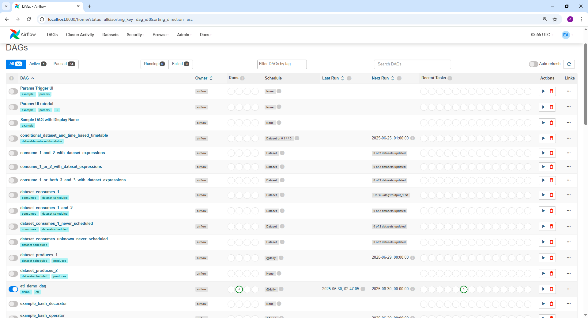
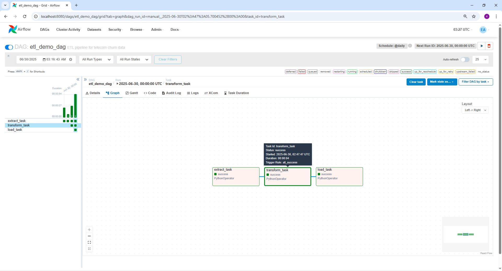
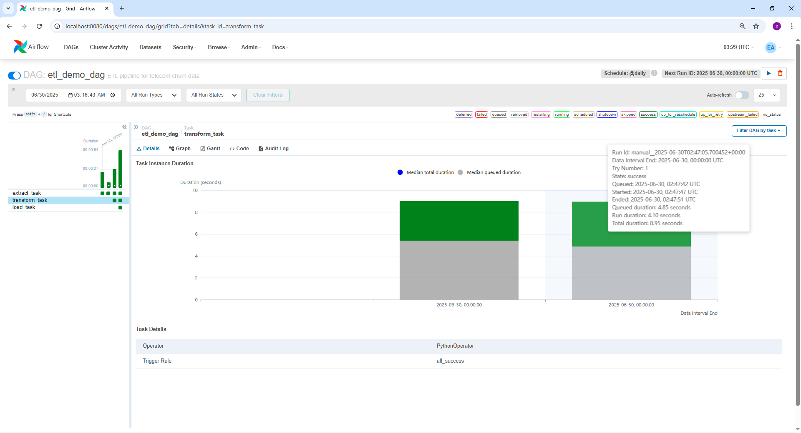
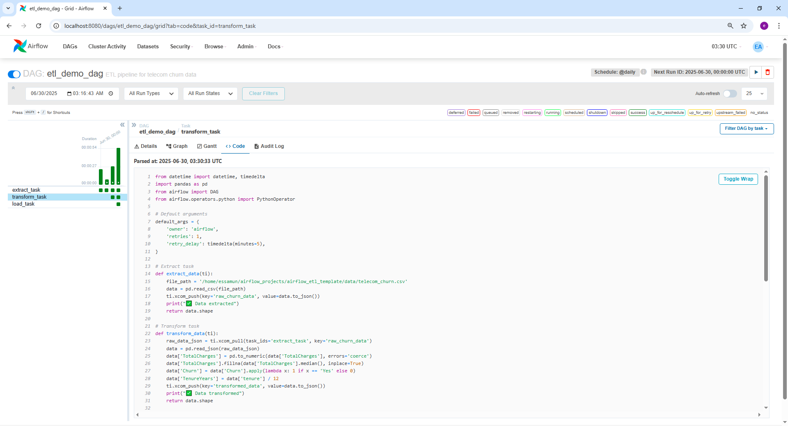

# 🌀 Apache Airflow ETL Demo Project

This project is a basic **ETL pipeline** using **Apache Airflow 2.9.1** that simulates extracting, transforming, and loading telecom churn data.

---

## 📌 Project Structure

- `etl_demo_dag.py` - Defines the DAG and ETL logic using PythonOperator.
- `data/telecom_churn.csv` - Input raw data.
- `data/processed_churn_data.csv` - Transformed output.
- `images/` - Screenshots for DAG views and task outputs.
- `requirements.txt` - Tested dependency list.

---

## ⚙️ ETL Flow

1. **Extract**: Reads a CSV file (`telecom_churn.csv`)
2. **Transform**: Cleans and prepares the dataset
3. **Load**: Saves to `processed_churn_data.csv`

---

## 📷 Screenshots

| DAGs List | DAG Graph |
|----------|-----------|
|  |  |

| Task Duration | DAG Code |
|---------------|-----------|
|  |  |

| Processed File |
|----------------|
|  |

---

## 🚀 How to Run

```bash
# Clone repo and enter
git clone https://github.com/your-username/airflow_etl_template.git
cd airflow_etl_template

# Set up virtual environment
python3 -m venv venv
source venv/bin/activate

# Install requirements
pip install -r requirements.txt

# Initialize and start Airflow
export AIRFLOW_HOME=$(pwd)/airflow_home
airflow db init
airflow webserver --port 8080
airflow scheduler
